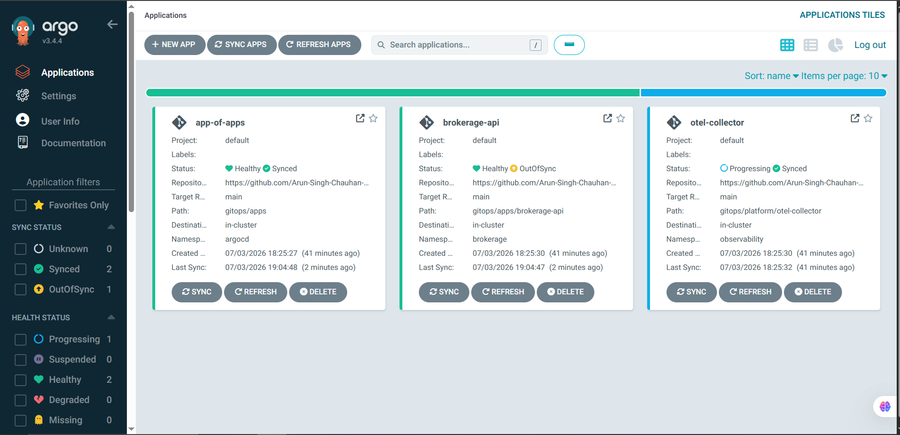
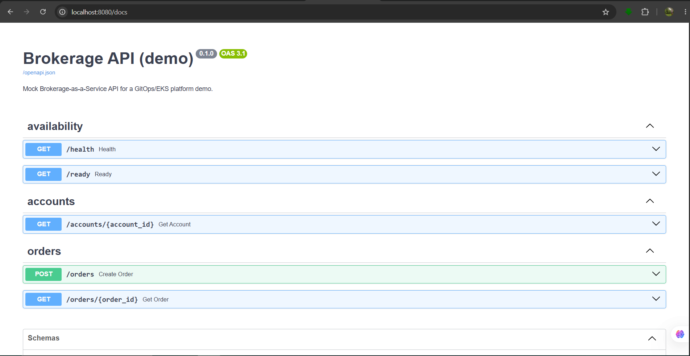
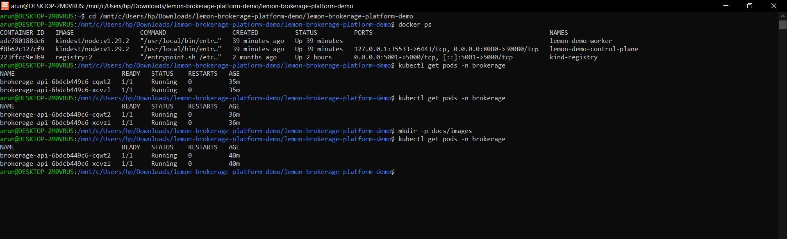

# lemon-brokerage-platform-demo

A GitOps-managed Kubernetes platform hosting a mock brokerage API, where
**reliability, security, and compliance are treated as the product** — not as
afterthoughts. It mirrors how a Brokerage-as-a-Service provider runs
institutional-grade infrastructure: EKS on AWS, Terraform/OpenTofu, ArgoCD,
and OpenTelemetry → DataDog observability.

Built as a proof-of-work for a Cloud/DevOps engineering role on a regulated
financial platform.


> **Status:** MVP complete. Runs end-to-end locally on a kind cluster; the
> production EKS path is documented. Both CI and security pipelines pass.

---

## Why this exists

A brokerage API's value *is* its reliability and compliance. So this repo is
shaped like a miniature version of that platform, and every infrastructure
choice maps to a concrete requirement:

| Requirement | How it shows up here |
|---|---|
| GitOps deployments (ArgoCD) | App-of-Apps pattern reconciles all workloads from Git |
| Kubernetes on AWS (EKS) | Local kind by default; documented one-command EKS path |
| IaC (Terraform / OpenTofu) | Modular `infra/` with VPC, EKS, RDS, IRSA |
| Observability (OpenTelemetry, DataDog) | App emits OTLP → Collector → DataDog, exporter swappable |
| IAM best practices | IRSA module: scoped, per-ServiceAccount roles |
| Security & compliance | tfsec + Checkov + Trivy CI gates, OPA policies, RDS encrypted with a customer-managed KMS key |
| 24/7 availability | Multi-replica, HPA, PodDisruptionBudget, health/readiness probes |

## Architecture

```
                 git push
  developer ───────────────► GitHub ──► GitHub Actions (CI + security gates)
                                │
                                │ ArgoCD watches the repo
                                ▼
        ┌─────────────────── EKS / kind cluster ───────────────────┐
        │                                                          │
        │   ArgoCD (App-of-Apps)                                   │
        │      ├── brokerage-api  (2+ replicas, HPA, PDB)          │
        │      │       │ OTLP                                      │
        │      │       ▼                                           │
        │      └── otel-collector ──► DataDog  (swappable export)  │
        │                                                          │
        └──────────────────────────────────────────────────────────┘
```

The mock API exposes endpoints shaped after a real brokerage's core domains:
`POST /orders` (order management + execution), `GET /accounts/{id}` (account
management), and `/health` + `/ready` (availability probes). Order creation
produces nested OpenTelemetry spans (`create_order` → `risk_check` →
`execute_order`) so you get a real distributed trace to look at in DataDog.

## Screenshots

The platform running end-to-end on a local kind cluster:

**ArgoCD reconciling all applications from Git (GitOps loop closed):**



**Auto-generated OpenAPI docs for the brokerage API:**



**Pods running in the cluster, served via NodePort:**



## Quickstart

### Just run the API (fastest — only needs Python)

```bash
./scripts/quickstart.sh      # creates a venv, installs deps, runs tests
make run                      # serves the API on http://localhost:8080
```

Then, in another terminal:

```bash
curl localhost:8080/health
curl -X POST localhost:8080/orders \
  -H 'content-type: application/json' \
  -d '{"account_id":"acc_demo_001","isin":"US0378331005","side":"buy","quantity":1}'
```

`make` handles the Python virtualenv for you — no manual `venv`/`pip` steps, and
it auto-detects `python3` vs `python`. Run `make check` anytime to see what's
installed.

### Full cluster demo (GitOps on Kubernetes)

Needs `docker`, `kind`, and `kubectl`. On Ubuntu/WSL you can install kind +
kubectl with:

```bash
./scripts/install-tools.sh    # installs kubectl + kind (Docker Desktop separate)
make check                    # confirm everything is present
```

Then bring up the whole platform:

```bash
# Optional: wire DataDog first
export DD_API_KEY=xxxxxxxx
make datadog-secret

make demo                     # cluster -> ArgoCD -> build -> deploy via GitOps
```

`make demo` runs every step in order: create the kind cluster, install ArgoCD
(server-side apply), build the image, load it into the cluster, create the
namespace, and hand off to ArgoCD. Deploying by hand instead requires building
and loading the image before the pods can start.

Open the ArgoCD UI:

```bash
kubectl -n argocd get secret argocd-initial-admin-secret \
  -o jsonpath='{.data.password}' | base64 -d ; echo
kubectl port-forward svc/argocd-server -n argocd 8081:443
# visit https://localhost:8081  (user: admin)
```

Tear down with `make destroy`.

## Running without DataDog

DataDog free trials are time-limited. The app always speaks OTLP to the
Collector; **which backend the Collector exports to is one config change**, not
a code change. In `gitops/platform/otel-collector/configmap.yaml`, switch the
traces/metrics pipeline `exporters` from `[datadog]` to `[debug]` (or wire an
OTLP exporter to Grafana Tempo). The platform keeps working; only the
destination changes. This is deliberate — it shows the observability layer is
vendor-portable, which matters for any team avoiding lock-in.

## Repository layout

```
app/        FastAPI mock brokerage API + OpenTelemetry instrumentation
infra/      Terraform/OpenTofu (local kind + documented EKS path)
gitops/     Everything ArgoCD reconciles (App-of-Apps, app + platform manifests)
policies/   Compliance-as-code: Checkov config + OPA/Conftest rules
scripts/    quickstart.sh (app setup) + install-tools.sh (kind/kubectl)
docs/       Architecture, EKS migration, compliance mapping, runbooks
.github/    CI and security-gate workflows
```

## The real-AWS path

This runs locally on kind so it's free to demo, but the Terraform modules and
`docs/eks-migration.md` document the exact path to a real EKS deployment
(Frankfurt region for EU data residency, encrypted multi-AZ RDS, IRSA-scoped
IAM, ECR images). The local-vs-cloud split is intentional: it keeps the demo
reproducible while showing the production design.

## Status

MVP. See [docs/architecture.md](docs/architecture.md) for design decisions and
the stretch-goal backlog (Argo Workflows reporting batch, cert-manager/TLS,
synthetic uptime monitor, External Secrets Operator).
